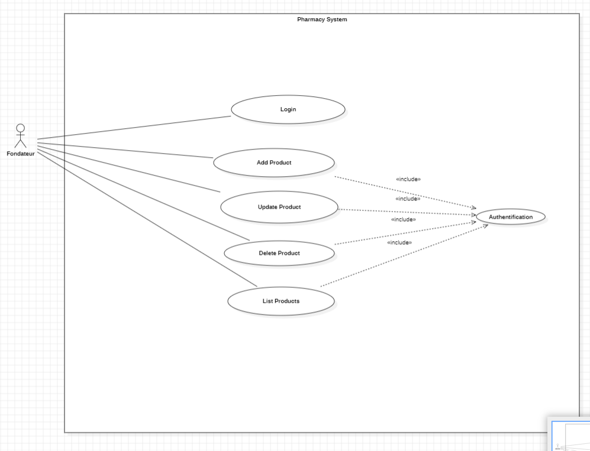

<<<<<<< HEAD
#  Pharmacy Management System

##  Description

Ce projet est une application **Full-Stack** permettant la gestion d’une pharmacie.  
Elle offre les fonctionnalités suivantes :

-  Ajouter un produit
- Modifier un produit
-  Supprimer un produit
-  Consulter la liste des produits

 Deux rôles principaux :
- **Fondateur** : gère les produits.
- **Client** : consulte les produits disponibles.

---

## Architecture du projet

- **Backend :** Spring Boot (REST API, JPA, Hibernate, MySQL)
- **Frontend :** Angular + Bootstrap
- **Communication :** JSON via REST
- **Gestion de version :** Git & GitHub
## UML


```mermaid
flowchart TD
    A[Frontend - Angular] -->|HTTP/JSON| B[Backend - Spring Boot REST API]
    B --> C[(Base de données MySQL)]

=======


>>>>>>> 9f55eac6efa4d5d1ffa2cfa88c1faf277eaecbda
